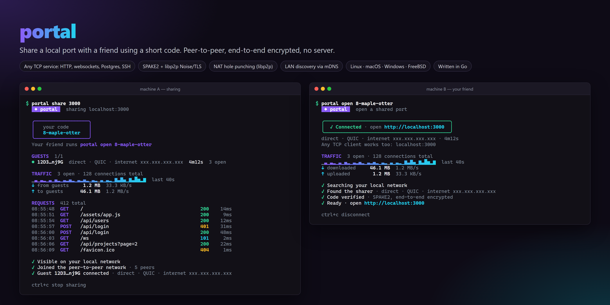
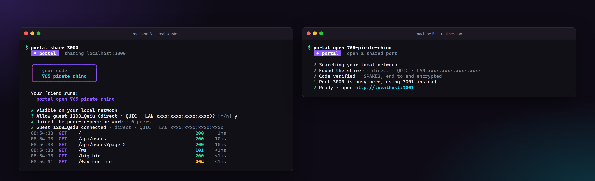
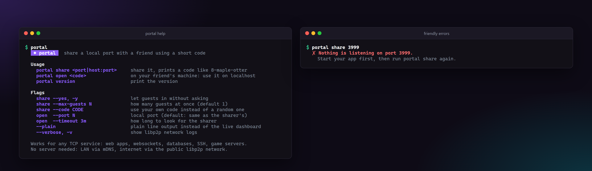

# portal

Share a local port with a friend using a short code. Peer-to-peer, end-to-end encrypted, **no server, no account, no domain**.



```sh
portal share 3000              # prints a code like 8-maple-otter
portal open 8-maple-otter      # on your friend's machine: http://localhost:3000 now reaches yours
```

Works for **any TCP service**, not just HTTP: web apps, websockets, dev servers with hot reload, Postgres/MySQL/Redis, SSH, game servers. Linux, macOS, Windows and FreeBSD, in any combination.

While sharing you get a live dashboard: who is connected and how (direct · QUIC · LAN/internet), open connections, bytes and speed with a throughput sparkline, and, if the traffic is HTTP, a scrolling request log (`GET /api/users  200  12ms`).

<p align="center">
  
</p>

## Install

**Linux / macOS** (detects your architecture, verifies the checksum):

```sh
curl -fsSL https://raw.githubusercontent.com/KhadeerBasha1232/portal/main/install.sh | sh
```

**Linux packages** from the [releases page](https://github.com/KhadeerBasha1232/portal/releases):

| Distro | Install |
|---|---|
| Debian / Ubuntu / Mint / Pop!_OS | `sudo apt install ./portal_*_amd64.deb` |
| Fedora / RHEL / Rocky / openSUSE | `sudo dnf install ./portal-*.x86_64.rpm` |
| Alpine | `sudo apk add --allow-untrusted ./portal_*.apk` |
| Arch / Manjaro | `sudo pacman -U ./portal-*.pkg.tar.zst` |

Builds exist for `x86_64`, `arm64` (e.g. Raspberry Pi 4/5, Apple Silicon, Graviton) and `armv7`.

**Windows**: download `portal_*_windows_x86_64.zip` from the releases page and put `portal.exe` on your `PATH`.

**From source** (Go 1.26+): `go install github.com/KhadeerBasha1232/portal@latest`

## Usage

```sh
portal share 3000                  # share localhost:3000
portal share 192.168.1.20:5432     # or anything this machine can reach
portal open 8-maple-otter          # friend: same port number locally (or the next free one)

portal share 3000 --yes            # let guests in without asking
portal share 3000 --max-guests 3   # several friends at once
portal open 8-maple-otter --port 8080
```

The sharer is asked `Allow guest? [Y/n]` before anyone gets in. The guest's side listens on `127.0.0.1` only, never on the network. If the connection drops, the guest reconnects on its own; when the sharer presses Ctrl-C, the guest is told and exits cleanly.

Output is a live dashboard on a terminal and plain lines when piped (or with `--plain`). Set `CLICOLOR_FORCE=1` to keep colors when piping or recording.

<p align="center">
  
</p>

## How it works

```
 sharer                                                    guest
   │  1. find each other                                      │
   │     LAN:      mDNS multicast                             │
   │     internet: public libp2p/IPFS DHT, key = nameplate "8" │
   │  2. connect directly                                     │
   │     direct dial, or a public relay + hole punch (DCUtR)  │
   │  3. control stream: SPAKE2 with "8-maple-otter" ◀────────│
   │     bound to both peer IDs → guest's peer ID authorized  │
   │  4. every TCP connection = a new libp2p stream ◀─────────│
   │     accepted only from authorized peer IDs               │
   ▼  localhost:3000                       127.0.0.1:3000  ◀── browser / psql / ssh
```

- **Code**: the number (`8`) is a public *nameplate* used only to find each other. The words are the password and never leave your machine.
- **SPAKE2** (a PAKE) turns the short code into a strong shared key. An attacker who sees everything still can't brute-force the code offline: they get one online guess per try, and the sharer stops after **3 wrong codes**.
- **Why plain libp2p streams are safe after that**: every libp2p connection is authenticated and encrypted end to end by peer ID (Noise or TLS 1.3 prove possession of the peer's private key). The PAKE transcript is bound to *both* peer IDs, so a successful handshake proves "the peer with this exact ID knows the code", which a man in the middle cannot fake. The sharer then authorizes that peer ID, and accepts `/portal/1.0.0/tcp` streams only from currently connected, authorized guests. Authorization ends when the guest's control stream ends.
- **Direct only**: the sharer reserves a slot on a public libp2p relay so guests behind NAT can reach it, then libp2p hole-punches a direct connection. Tunnel streams are refused on relayed connections, so your traffic never flows through a relay. If only a relayed path is possible, `portal open` says so.
- **Request log**: the HTTP log is a passive tap on bytes that were already forwarded. It understands just enough HTTP/1.x to follow keep-alive connections and switches itself off at the first byte that isn't HTTP (databases, SSH, TLS, HTTP/2, websockets after the upgrade), so it can never break other protocols.

**Limitation**: with no server of its own, portal can't connect two machines that are both behind strict NATs (some mobile carriers, corporate firewalls) that can't be hole-punched. LAN and most home networks work. Try a phone hotspot on one side if you hit this.

## Development

```sh
go vet ./... && go test ./...
```

Tests cover the code parser, the handshake (right code, wrong code, peer-ID binding, tampering), the HTTP sniffer, and an in-process tunnel between two libp2p hosts (unauthorized streams, wrong codes, declines, max guests, reconnects).

## Building a release

Push a tag and GitHub Actions builds every platform with GoReleaser:

```sh
git tag v0.1.0 && git push origin v0.1.0
```

## License

MIT
